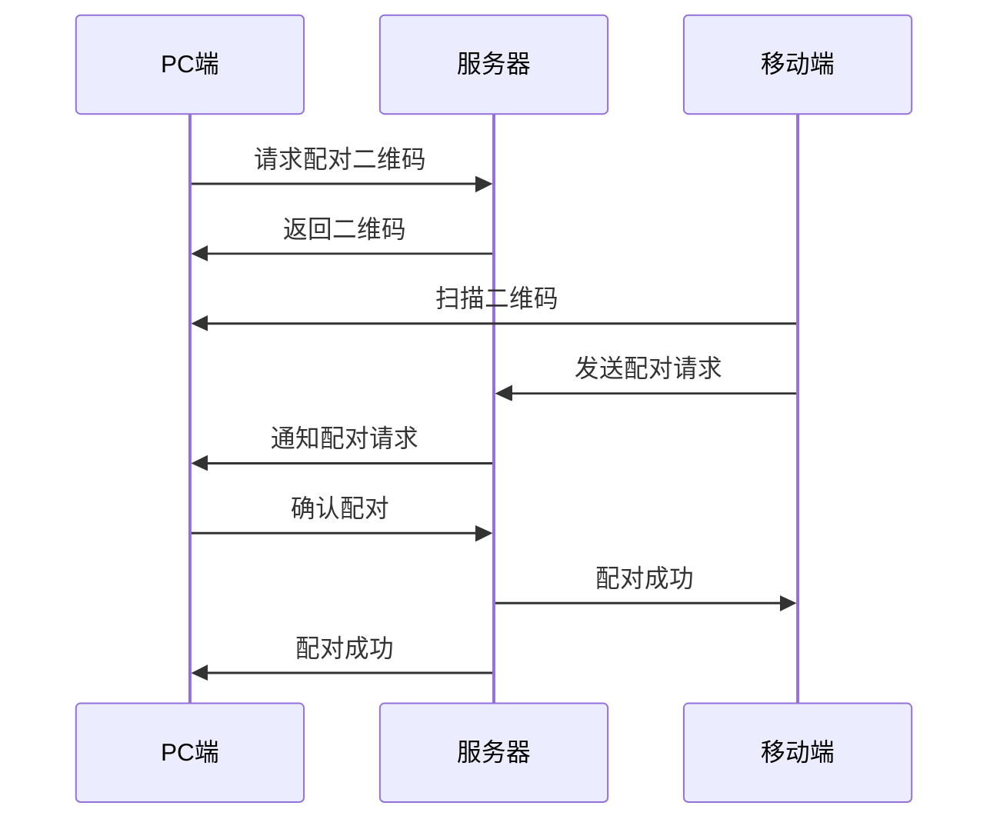
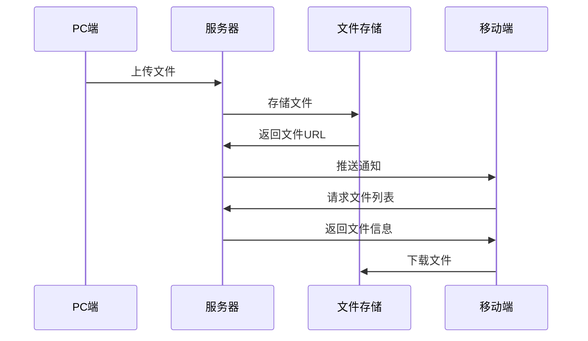

# 跨平台文件传输应用设计文档

## 📋 项目概述

### 项目目标
开发一个现代化的跨平台文件传输解决方案，支持PC和移动设备之间的快速、安全文件传输，提供比微信文件传输助手更好的用户体验和文件组织功能。

### 核心价值
- **便捷性**: 一键截图传输，拖拽文件上传
- **安全性**: 端到端加密，设备认证
- **高效性**: P2P直连 + 云端中转的混合传输
- **智能性**: 自动文件分类，智能压缩

## 🏗️ 技术架构

### 整体架构图

```
┌─────────────────────────────────────────────────────────────┐
│                    跨平台文件传输系统                        │
├─────────────────┬─────────────────┬─────────────────────────┤
│   PC端应用      │   移动端应用     │      后端服务           │
│  (Electron)     │ (React Native)  │     (Node.js)          │
├─────────────────┼─────────────────┼─────────────────────────┤
│ • 浮动窗口      │ • 文件管理      │ • RESTful API          │
│ • 截图快传      │ • 实时接收      │ • Socket.io服务        │
│ • 拖拽上传      │ • 推送通知      │ • 文件存储管理          │
│ • 传输历史      │ • 图片预览      │ • 用户认证             │
└─────────────────┴─────────────────┴─────────────────────────┘
         │                   │                   │
         └───────────────────┼───────────────────┘
                             │
    ┌────────────────────────┼────────────────────────┐
    │                       │                        │
┌───▼────┐        ┌────────▼────────┐        ┌──────▼──────┐
│MongoDB │        │   文件存储       │        │   Redis     │
│(数据库) │        │ (S3/OSS/Local)  │        │  (缓存)     │
└────────┘        └─────────────────┘        └─────────────┘
```

### 技术选型理由

#### PC端 - Electron + React
**选择理由:**
- **跨平台兼容**: 一套代码支持Windows、macOS、Linux
- **丰富生态**: React生态成熟，组件库丰富
- **系统集成**: 支持系统托盘、全局快捷键、截图API
- **开发效率**: Web技术栈，开发调试便捷

**替代方案对比:**
- Tauri: 更轻量但生态较新
- Qt: 性能好但学习成本高
- WPF: 仅支持Windows

#### 移动端 - React Native
**选择理由:**
- **一套代码**: 同时支持Android和iOS
- **技术统一**: 与PC端使用相同的React技术栈
- **性能优秀**: 接近原生应用性能
- **社区活跃**: 大量第三方库和解决方案

**替代方案对比:**
- Flutter: 性能更好但需要学习Dart
- 原生开发: 性能最佳但开发成本高
- Ionic: 基于WebView，性能较差

#### 后端 - Node.js + Express
**选择理由:**
- **技术统一**: 全栈JavaScript，降低学习成本
- **实时通信**: Socket.io提供优秀的实时通信能力
- **生态丰富**: npm包生态完善
- **开发效率**: 快速原型开发，迭代速度快

## 🎨 UI/UX设计

### 设计原则
1. **简洁至上**: 界面简洁，操作直观
2. **一致性**: 跨平台界面风格统一
3. **响应式**: 适配不同屏幕尺寸
4. **可访问性**: 支持无障碍访问

### PC端界面设计

#### 浮动窗口设计
```
┌─────────────────────────────────┐
│ 📷 ⚙️                    ─ □ ✕ │ ← 标题栏
├─────────────────────────────────┤
│                                 │
│        拖拽文件到此处            │ ← 拖拽区域
│         📁 选择文件              │
│                                 │
├─────────────────────────────────┤
│ 📱 已连接设备: iPhone 13        │ ← 设备状态
├─────────────────────────────────┤
│ 📄 screenshot_001.png    ✓     │
│ 📄 document.pdf          ⏳     │ ← 传输列表
│ 📄 image.jpg             ❌     │
└─────────────────────────────────┘
```

**特性:**
- **尺寸**: 320x480px，可调整
- **透明度**: 95%透明度，毛玻璃效果
- **置顶**: 始终保持在最前面
- **拖拽**: 支持窗口拖拽移动

### 移动端界面设计

#### 底部导航结构
```
┌─────────────────────────────────┐
│            首页                  │
│                                 │
│  ┌─────────┐  ┌─────────┐       │
│  │ 连接状态 │  │ 快速操作 │       │
│  └─────────┘  └─────────┘       │
│                                 │
│        最近传输文件              │
│  ┌─────────────────────────┐    │
│  │ 📷 screenshot.png       │    │
│  │ 📄 document.pdf         │    │
│  └─────────────────────────┘    │
└─────────────────────────────────┘
│  🏠   📁   ⇄   ⚙️  │ ← 底部导航
└─────────────────────┘
```

### 交互流程设计

#### 设备配对流程


#### 文件传输流程


## 🔧 核心功能模块

### 1. 文件传输模块

#### 传输机制
- **本地网络**: WebRTC P2P直连
- **跨网络**: 云端中转服务
- **大文件**: 分片上传，断点续传
- **压缩**: 图片智能压缩，文档原样传输

#### 传输协议
```typescript
interface TransferProtocol {
  version: string;
  type: 'p2p' | 'relay';
  encryption: 'aes-256-gcm';
  compression: 'gzip' | 'none';
  chunkSize: number;
  checksum: string;
}
```

### 2. 设备管理模块

#### 设备认证
- **配对方式**: 二维码扫描配对
- **认证机制**: JWT令牌 + 设备指纹
- **权限控制**: 基于设备的访问控制

#### 设备状态
```typescript
interface DeviceStatus {
  id: string;
  name: string;
  type: 'desktop' | 'mobile';
  platform: string;
  isOnline: boolean;
  lastSeen: Date;
  capabilities: string[];
}
```

### 3. 文件管理模块

#### 智能分类
- **图片文件**: jpg, png, gif, webp等
- **文档文件**: pdf, doc, docx, txt等
- **压缩文件**: zip, rar, 7z等
- **其他文件**: 未分类文件

#### 存储策略
- **临时存储**: 7天自动清理
- **重要文件**: 用户标记，长期保存
- **缓存机制**: Redis缓存热点文件

### 4. 安全模块

#### 加密传输
- **传输加密**: TLS 1.3 + AES-256-GCM
- **文件加密**: 客户端加密，服务端存储密文
- **密钥管理**: 基于设备的密钥派生

#### 访问控制
- **设备白名单**: 只允许配对设备访问
- **文件权限**: 基于文件的访问控制
- **审计日志**: 完整的操作日志记录

## 📊 数据库设计

### MongoDB集合设计

#### Users集合
```javascript
{
  _id: ObjectId,
  userId: String,
  devices: [DeviceId],
  settings: {
    autoCleanup: Boolean,
    compressionLevel: Number,
    notificationEnabled: Boolean
  },
  createdAt: Date,
  updatedAt: Date
}
```

#### Files集合
```javascript
{
  _id: ObjectId,
  fileId: String,
  originalName: String,
  size: Number,
  mimeType: String,
  hash: String,
  storageType: String, // 'local' | 's3' | 'oss'
  storagePath: String,
  uploadedBy: String,
  uploadedAt: Date,
  expiresAt: Date,
  downloadCount: Number,
  isDeleted: Boolean
}
```

#### Transfers集合
```javascript
{
  _id: ObjectId,
  transferId: String,
  fileId: String,
  fromDevice: String,
  toDevice: String,
  status: String, // 'pending' | 'uploading' | 'completed' | 'failed'
  progress: Number,
  speed: Number,
  startedAt: Date,
  completedAt: Date,
  error: String
}
```

## 🚀 开发路线图

### MVP阶段 (第1-2周)
- [x] 项目结构搭建
- [ ] PC端浮动窗口基础框架
- [ ] 移动端基础界面
- [ ] 后端API服务
- [ ] 基础文件上传下载功能

### 第二阶段 (第3-4周)
- [ ] 设备配对功能
- [ ] 实时传输状态
- [ ] 推送通知系统
- [ ] 文件分类管理

### 第三阶段 (第5-6周)
- [ ] P2P直连功能
- [ ] 截图快传功能
- [ ] 高级文件管理
- [ ] 性能优化

### 第四阶段 (第7-8周)
- [ ] 安全加固
- [ ] 用户体验优化
- [ ] 测试和调试
- [ ] 部署和发布

## 📈 性能指标

### 目标指标
- **传输速度**: 局域网 > 50MB/s，广域网 > 5MB/s
- **响应时间**: API响应 < 200ms
- **文件大小**: 支持最大 1GB 单文件
- **并发用户**: 支持 1000+ 并发连接
- **可用性**: 99.9% 服务可用性

### 监控指标
- **系统指标**: CPU、内存、磁盘、网络使用率
- **业务指标**: 传输成功率、平均传输时间
- **用户指标**: 活跃用户数、文件传输量

## 🔍 风险评估

### 技术风险
- **网络环境**: NAT穿透可能失败
- **文件大小**: 大文件传输稳定性
- **跨平台**: 不同平台兼容性问题

### 解决方案
- **备用方案**: P2P失败时自动切换云端中转
- **分片传输**: 大文件分片上传，支持断点续传
- **充分测试**: 多平台兼容性测试

## 🔌 API接口设计

### RESTful API规范

#### 认证接口
```
POST /api/auth/register        # 设备注册
POST /api/auth/login          # 设备登录
POST /api/auth/refresh        # 刷新令牌
POST /api/auth/logout         # 登出
GET  /api/auth/qrcode         # 获取配对二维码
POST /api/auth/pair           # 设备配对
```

#### 文件接口
```
POST /api/files/upload        # 上传文件
GET  /api/files               # 获取文件列表
GET  /api/files/:id           # 获取文件详情
GET  /api/files/:id/download  # 下载文件
DELETE /api/files/:id         # 删除文件
PUT  /api/files/:id/favorite  # 收藏文件
```

#### 设备接口
```
GET  /api/devices             # 获取设备列表
GET  /api/devices/:id         # 获取设备详情
PUT  /api/devices/:id         # 更新设备信息
DELETE /api/devices/:id       # 移除设备
```

### Socket.io事件设计

#### 客户端事件
```typescript
// 认证事件
socket.emit('authenticate', { token: string });

// 文件传输事件
socket.emit('file:upload:start', {
  fileName: string,
  fileSize: number,
  fileType: string,
  targetDevice: string
});
socket.emit('file:upload:chunk', {
  fileId: string,
  chunkIndex: number,
  chunkData: Buffer
});
socket.emit('file:upload:complete', { fileId: string });

// 设备事件
socket.emit('device:status', { status: 'online' | 'offline' });
socket.emit('device:pair:request', { qrCode: string });
```

#### 服务器事件
```typescript
// 认证响应
socket.emit('authenticated', {
  success: boolean,
  deviceId?: string,
  error?: string
});

// 文件传输状态
socket.emit('file:upload:progress', {
  fileId: string,
  progress: number,
  speed: number
});
socket.emit('file:upload:success', {
  fileId: string,
  downloadUrl: string
});
socket.emit('file:upload:error', {
  fileId: string,
  error: string
});

// 设备通知
socket.emit('device:connected', {
  deviceId: string,
  deviceInfo: DeviceInfo
});
socket.emit('device:file:received', {
  fileId: string,
  fileName: string,
  fromDevice: string
});
```

## 🎯 用户体验设计

### PC端用户流程

#### 首次使用流程
1. **安装启动**: 下载安装包，首次启动应用
2. **设备注册**: 自动生成设备ID，显示配对二维码
3. **移动端配对**: 使用移动端扫描二维码完成配对
4. **功能引导**: 简单的功能介绍和使用指南

#### 日常使用流程
1. **快速截图**: Ctrl+Shift+S 快捷键截图并传输
2. **拖拽传输**: 拖拽文件到浮动窗口进行传输
3. **查看状态**: 实时查看传输进度和历史记录

### 移动端用户流程

#### 文件接收流程
1. **推送通知**: 收到文件传输通知
2. **查看文件**: 点击通知进入应用查看文件
3. **文件操作**: 预览、保存到相册、分享给其他应用

#### 文件管理流程
1. **分类浏览**: 按类型查看不同文件
2. **搜索文件**: 通过文件名搜索特定文件
3. **批量操作**: 选择多个文件进行删除或分享

## 🔐 安全架构设计

### 多层安全防护

#### 传输层安全
- **协议**: HTTPS/WSS (TLS 1.3)
- **证书**: Let's Encrypt 自动续期
- **HSTS**: 强制HTTPS访问

#### 应用层安全
- **认证**: JWT + 设备指纹双重认证
- **授权**: RBAC基于角色的访问控制
- **加密**: AES-256-GCM端到端加密

#### 数据层安全
- **存储加密**: 文件静态加密存储
- **数据库**: MongoDB连接加密
- **备份**: 加密备份，异地存储

### 威胁模型分析

#### 潜在威胁
1. **中间人攻击**: 网络传输被拦截
2. **设备伪造**: 恶意设备尝试配对
3. **文件泄露**: 未授权访问文件
4. **拒绝服务**: 大量请求导致服务不可用

#### 防护措施
1. **证书绑定**: 客户端证书验证
2. **设备认证**: 多因素设备认证
3. **访问控制**: 细粒度权限控制
4. **限流保护**: API请求频率限制

## 📱 移动端技术细节

### React Native架构

#### 组件层次结构
```
App
├── Navigation
│   ├── TabNavigator
│   │   ├── HomeStack
│   │   ├── FilesStack
│   │   ├── TransferStack
│   │   └── SettingsStack
│   └── AuthStack
├── Components
│   ├── FileCard
│   ├── TransferProgress
│   ├── DeviceStatus
│   └── QRScanner
└── Services
    ├── ApiService
    ├── SocketService
    ├── NotificationService
    └── StorageService
```

#### 状态管理设计
```typescript
// 使用Zustand进行状态管理
interface AppState {
  // 用户状态
  user: User | null;
  isAuthenticated: boolean;

  // 设备状态
  devices: Device[];
  currentDevice: Device | null;

  // 文件状态
  files: FileInfo[];
  transfers: TransferRecord[];

  // UI状态
  isLoading: boolean;
  error: string | null;
}
```

### 原生模块集成

#### Android原生功能
- **文件访问**: Storage Access Framework
- **推送通知**: Firebase Cloud Messaging
- **相机权限**: Camera2 API
- **网络状态**: Network Connection Class

#### iOS原生功能
- **文件访问**: Document Provider
- **推送通知**: Apple Push Notification Service
- **相机权限**: AVFoundation
- **网络状态**: Network Framework

## 💻 PC端技术细节

### Electron架构设计

#### 进程架构
```
Main Process (Node.js)
├── Window Management
├── System Integration
├── File System Access
└── IPC Communication
    │
    └── Renderer Process (Chromium)
        ├── React Application
        ├── UI Components
        └── Business Logic
```

#### 系统集成功能
- **系统托盘**: 最小化到系统托盘
- **全局快捷键**: 注册系统级快捷键
- **开机自启**: 系统启动时自动运行
- **文件关联**: 关联特定文件类型

### 截图功能实现
```typescript
// 使用node-screenshots库实现截图
import { captureScreen } from 'node-screenshots';

async function captureAndUpload() {
  try {
    const screenshot = await captureScreen();
    const buffer = await screenshot.save();
    await uploadFile(buffer, 'screenshot.png');
  } catch (error) {
    console.error('截图失败:', error);
  }
}
```

## 🌐 后端服务架构

### 微服务设计

#### 服务拆分
```
API Gateway
├── Auth Service      # 认证授权服务
├── File Service      # 文件管理服务
├── Transfer Service  # 传输控制服务
├── Device Service    # 设备管理服务
└── Notification Service # 通知推送服务
```

#### 服务通信
- **同步通信**: HTTP/REST API
- **异步通信**: Redis Pub/Sub
- **实时通信**: Socket.io

### 数据存储策略

#### 分层存储
- **热数据**: Redis缓存，快速访问
- **温数据**: MongoDB，结构化存储
- **冷数据**: 对象存储，长期归档

#### 数据生命周期
```typescript
interface DataLifecycle {
  created: Date;      // 创建时间
  accessed: Date;     // 最后访问时间
  expires: Date;      // 过期时间
  archived: boolean;  // 是否已归档
}
```

## 📊 监控和运维

### 应用监控

#### 性能指标
- **响应时间**: API平均响应时间
- **吞吐量**: 每秒处理请求数
- **错误率**: 4xx/5xx错误比例
- **可用性**: 服务正常运行时间

#### 业务指标
- **传输成功率**: 文件传输成功比例
- **用户活跃度**: 日活跃用户数
- **文件大小分布**: 不同大小文件的传输情况

### 日志管理

#### 日志分类
- **访问日志**: HTTP请求记录
- **错误日志**: 应用错误信息
- **业务日志**: 业务操作记录
- **安全日志**: 安全相关事件

#### 日志格式
```json
{
  "timestamp": "2023-08-15T10:30:00Z",
  "level": "info",
  "service": "file-service",
  "traceId": "abc123",
  "userId": "user123",
  "action": "file.upload",
  "result": "success",
  "duration": 1250,
  "metadata": {
    "fileSize": 1048576,
    "fileType": "image/png"
  }
}
```

## 📝 总结

本设计文档详细描述了跨平台文件传输应用的技术架构、功能设计和实现方案。通过采用现代化的技术栈和合理的架构设计，能够实现一个高效、安全、易用的文件传输解决方案。

### 核心优势
1. **技术先进**: 采用最新的技术栈和架构模式
2. **用户体验**: 简洁直观的界面设计和流畅的交互体验
3. **安全可靠**: 多层安全防护和完善的错误处理机制
4. **可扩展性**: 模块化设计，便于功能扩展和维护

### 下一步计划
按照开发路线图逐步实现各个功能模块，并持续优化用户体验和系统性能。重点关注MVP功能的快速实现，然后逐步完善高级功能。
