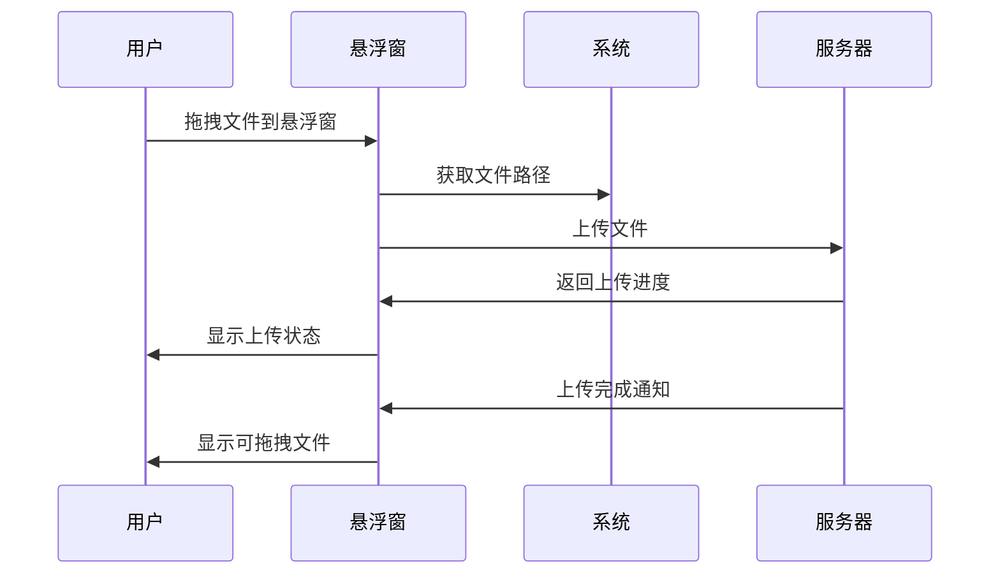
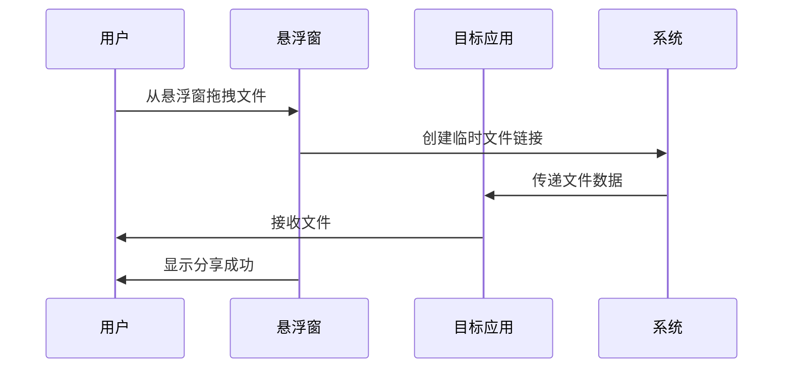
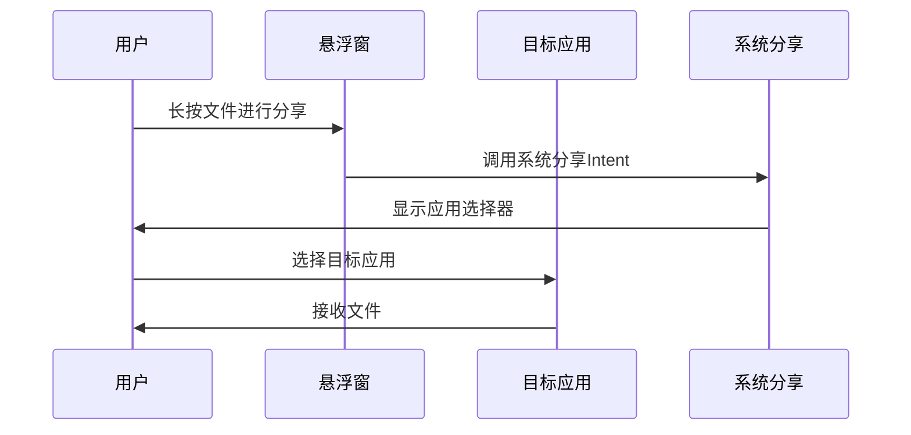
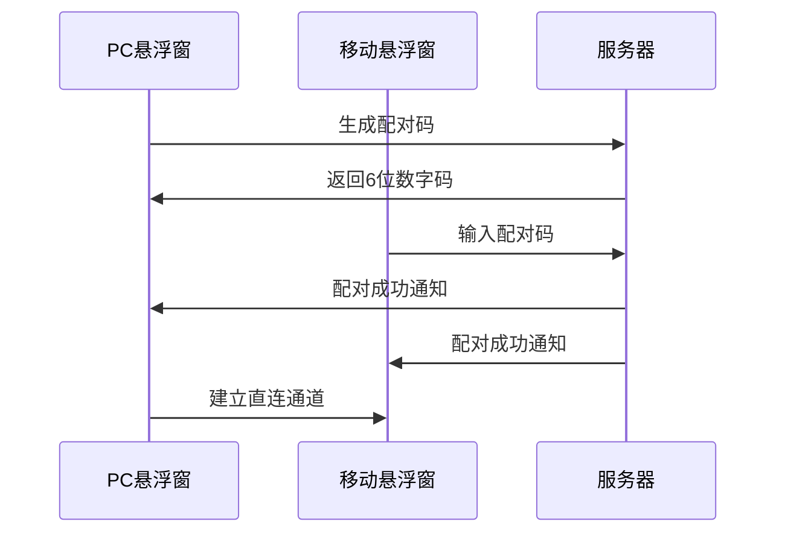

# 跨平台文件传输应用设计文档

## 📋 项目概述

### 项目目标
开发一个现代化的跨平台文件传输解决方案，支持PC和移动设备之间的快速、安全文件传输，提供比微信文件传输助手更好的用户体验和文件组织功能。

### 核心价值
- **便捷性**: 一键截图传输，拖拽文件上传
- **安全性**: 端到端加密，设备认证
- **高效性**: P2P直连 + 云端中转的混合传输
- **智能性**: 自动文件分类，智能压缩

## 🏗️ 技术架构

### 整体架构图

```
┌─────────────────────────────────────────────────────────────┐
│                    跨平台文件传输系统                        │
├─────────────────┬─────────────────┬─────────────────────────┤
│   PC端应用      │   移动端应用     │      后端服务           │
│  (Electron)     │ (React Native)  │     (Node.js)          │
├─────────────────┼─────────────────┼─────────────────────────┤
│ • 浮动窗口      │ • 文件管理      │ • RESTful API          │
│ • 截图快传      │ • 实时接收      │ • Socket.io服务        │
│ • 拖拽上传      │ • 推送通知      │ • 文件存储管理          │
│ • 传输历史      │ • 图片预览      │ • 用户认证             │
└─────────────────┴─────────────────┴─────────────────────────┘
         │                   │                   │
         └───────────────────┼───────────────────┘
                             │
    ┌────────────────────────┼────────────────────────┐
    │                       │                        │
┌───▼────┐        ┌────────▼────────┐        ┌──────▼──────┐
│MongoDB │        │   文件存储       │        │   Redis     │
│(数据库) │        │ (S3/OSS/Local)  │        │  (缓存)     │
└────────┘        └─────────────────┘        └─────────────┘
```

### 技术选型理由

#### PC端 - Electron + React
**选择理由:**
- **跨平台兼容**: 一套代码支持Windows、macOS、Linux
- **丰富生态**: React生态成熟，组件库丰富
- **系统集成**: 支持系统托盘、全局快捷键、截图API
- **开发效率**: Web技术栈，开发调试便捷

**替代方案对比:**
- Tauri: 更轻量但生态较新
- Qt: 性能好但学习成本高
- WPF: 仅支持Windows

#### 移动端 - React Native
**选择理由:**
- **一套代码**: 同时支持Android和iOS
- **技术统一**: 与PC端使用相同的React技术栈
- **性能优秀**: 接近原生应用性能
- **社区活跃**: 大量第三方库和解决方案

**替代方案对比:**
- Flutter: 性能更好但需要学习Dart
- 原生开发: 性能最佳但开发成本高
- Ionic: 基于WebView，性能较差

#### 后端 - Node.js + Express
**选择理由:**
- **技术统一**: 全栈JavaScript，降低学习成本
- **实时通信**: Socket.io提供优秀的实时通信能力
- **生态丰富**: npm包生态完善
- **开发效率**: 快速原型开发，迭代速度快

## 🎨 UI/UX设计

### 设计原则
1. **简洁至上**: 界面简洁，操作直观
2. **一致性**: 跨平台界面风格统一
3. **响应式**: 适配不同屏幕尺寸
4. **可访问性**: 支持无障碍访问

### PC端界面设计

#### 紧凑悬浮窗设计 (280x200px)
```
┌─────────────────────────────┐
│ 📁 ⚙️              ─ □ ✕ │ ← 极简标题栏
├─────────────────────────────┤
│     拖拽文件到此处           │ ← 主拖拽区域
│        📤 上传              │
├─────────────────────────────┤
│ 📱 iPhone 13 ●             │ ← 设备状态
├─────────────────────────────┤
│ 📄 image.png      [拖拽]    │ ← 可拖拽文件列表
│ 📄 doc.pdf        [拖拽]    │   (最多显示2-3个)
└─────────────────────────────┘
```

#### 最小化模式 (60x60px)
```
┌─────────┐
│   📁    │ ← 悬浮图标
│  (3)    │ ← 文件数量
└─────────┘
```

**核心特性:**
- **尺寸**: 280x200px 正常模式，60x60px 最小化模式
- **透明度**: 90%透明度，高斯模糊背景
- **置顶**: 系统级始终置顶，优先级高于所有应用
- **拖拽**: 双向拖拽 - 拖入上传，拖出分享
- **自动隐藏**: 鼠标离开3秒后自动半透明
- **智能定位**: 自动避开其他窗口，贴边吸附

### 移动端界面设计

#### 悬浮窗模式设计

##### 展开状态 (320x400px)
```
┌─────────────────────────────┐
│ 📁 文件传输    ─ □ ✕       │ ← 标题栏
├─────────────────────────────┤
│ 📱 PC已连接 ●              │ ← 连接状态
├─────────────────────────────┤
│ 📄 image.png     [分享]     │ ← 可分享文件
│ 📄 doc.pdf       [分享]     │   (支持拖拽到其他应用)
│ 📄 video.mp4     [分享]     │
├─────────────────────────────┤
│     📤 接收新文件            │ ← 接收区域
└─────────────────────────────┘
```

##### 最小化状态 (80x80px)
```
┌─────────┐
│   📁    │ ← 悬浮图标
│  (5)    │ ← 文件数量
│   ●     │ ← 连接状态
└─────────┘
```

##### 通知气泡模式 (200x60px)
```
┌─────────────────────┐
│ 📄 收到新文件        │ ← 新文件通知
│ image.png [查看]     │
└─────────────────────┘
```

**移动端特性:**
- **权限**: Android System Alert Window，iOS Picture-in-Picture
- **手势**: 长按拖拽分享，双击展开/收起
- **自适应**: 根据屏幕方向自动调整位置
- **分享集成**: 直接拖拽到微信、邮件等应用
- **通知**: 新文件到达时显示气泡通知

### 交互流程设计

#### 悬浮窗拖拽交互流程

##### PC端拖拽上传流程


##### PC端拖拽分享流程


##### 移动端分享流程


#### 设备配对流程（简化版）


## 🎯 悬浮窗技术实现

### PC端悬浮窗技术方案

#### Electron窗口配置
```typescript
// 悬浮窗配置
const floatWindowConfig = {
  width: 280,
  height: 200,
  frame: false,
  alwaysOnTop: true,
  skipTaskbar: true,
  resizable: false,
  transparent: true,
  hasShadow: false,
  webPreferences: {
    nodeIntegration: true,
    contextIsolation: false,
  },
  // 窗口级别设置为最高
  level: 'screen-saver',
  // 禁用窗口动画
  show: false,
};

// 最小化模式配置
const miniWindowConfig = {
  width: 60,
  height: 60,
  // 其他配置同上
};
```

#### 系统级拖拽实现
```typescript
// 拖拽接收
window.addEventListener('dragover', (e) => {
  e.preventDefault();
  e.dataTransfer.dropEffect = 'copy';
});

window.addEventListener('drop', async (e) => {
  e.preventDefault();
  const files = Array.from(e.dataTransfer.files);
  await handleFileUpload(files);
});

// 拖拽输出
const handleFileDragStart = (fileInfo) => {
  // 创建临时文件链接
  const tempPath = await createTempFileLink(fileInfo);

  // 设置拖拽数据
  e.dataTransfer.setData('text/uri-list', tempPath);
  e.dataTransfer.effectAllowed = 'copy';
};
```

### 移动端悬浮窗技术方案

#### Android System Alert Window
```typescript
// 权限申请
import { check, request, PERMISSIONS } from 'react-native-permissions';

const requestOverlayPermission = async () => {
  const permission = PERMISSIONS.ANDROID.SYSTEM_ALERT_WINDOW;
  const result = await check(permission);

  if (result !== 'granted') {
    await request(permission);
  }
};

// 悬浮窗服务
// android/app/src/main/java/FloatingWindowService.java
public class FloatingWindowService extends Service {
  private WindowManager windowManager;
  private View floatingView;

  @Override
  public void onCreate() {
    super.onCreate();

    // 创建悬浮窗布局
    floatingView = LayoutInflater.from(this)
      .inflate(R.layout.floating_window, null);

    // 设置窗口参数
    WindowManager.LayoutParams params = new WindowManager.LayoutParams(
      WindowManager.LayoutParams.WRAP_CONTENT,
      WindowManager.LayoutParams.WRAP_CONTENT,
      WindowManager.LayoutParams.TYPE_APPLICATION_OVERLAY,
      WindowManager.LayoutParams.FLAG_NOT_FOCUSABLE,
      PixelFormat.TRANSLUCENT
    );

    windowManager = (WindowManager) getSystemService(WINDOW_SERVICE);
    windowManager.addView(floatingView, params);
  }
}
```

#### iOS悬浮窗实现
```typescript
// 使用Picture-in-Picture模式
import PictureInPicture from 'react-native-picture-in-picture';

const enableFloatingMode = async () => {
  try {
    await PictureInPicture.enter({
      width: 320,
      height: 400,
      enablePlayPause: false,
      enableSkipButtons: false,
    });
  } catch (error) {
    console.error('PiP模式启动失败:', error);
  }
};

// 或使用自定义悬浮窗（需要原生模块）
// ios/FloatingWindow.swift
class FloatingWindow: UIWindow {
  override init(frame: CGRect) {
    super.init(frame: frame)

    // 设置窗口级别
    self.windowLevel = UIWindow.Level.statusBar + 1
    self.backgroundColor = UIColor.clear
    self.isHidden = false
  }
}
```

## 🔧 核心功能模块

### 1. 悬浮窗管理模块

#### 窗口状态管理
```typescript
interface FloatingWindowState {
  isVisible: boolean;
  isMinimized: boolean;
  position: { x: number; y: number };
  size: { width: number; height: number };
  opacity: number;
  alwaysOnTop: boolean;
}

class FloatingWindowManager {
  private state: FloatingWindowState;

  // 切换最小化状态
  toggleMinimize(): void;

  // 自动隐藏
  autoHide(delay: number): void;

  // 智能定位
  smartPosition(): void;

  // 贴边吸附
  snapToEdge(): void;
}
```

### 2. 文件传输模块

#### 拖拽传输机制
- **拖入上传**: 支持多文件同时拖拽上传
- **拖出分享**: 创建临时文件链接，支持拖拽到任意应用
- **实时预览**: 拖拽过程中显示文件缩略图
- **智能压缩**: 根据目标应用自动选择压缩策略

#### 跨应用拖拽协议
```typescript
interface DragTransferProtocol {
  // PC端拖拽数据格式
  dragData: {
    type: 'file' | 'text' | 'image';
    mimeType: string;
    fileName: string;
    fileSize: number;
    tempPath: string;  // 临时文件路径
    downloadUrl: string;  // 云端下载链接
  };

  // 移动端分享数据格式
  shareData: {
    type: 'file' | 'text' | 'image';
    uri: string;
    mimeType: string;
    fileName: string;
    intent: 'share' | 'send' | 'view';
  };
}
```

#### 传输优化策略
- **本地优先**: 同设备间直接文件系统操作
- **P2P直连**: 局域网内设备间直接传输
- **云端中转**: 跨网络传输的备用方案
- **智能路由**: 根据网络状况自动选择最优路径

### 2. 设备管理模块

#### 设备认证
- **配对方式**: 二维码扫描配对
- **认证机制**: JWT令牌 + 设备指纹
- **权限控制**: 基于设备的访问控制

#### 设备状态
```typescript
interface DeviceStatus {
  id: string;
  name: string;
  type: 'desktop' | 'mobile';
  platform: string;
  isOnline: boolean;
  lastSeen: Date;
  capabilities: string[];
}
```

### 3. 文件管理模块

#### 智能分类
- **图片文件**: jpg, png, gif, webp等
- **文档文件**: pdf, doc, docx, txt等
- **压缩文件**: zip, rar, 7z等
- **其他文件**: 未分类文件

#### 存储策略
- **临时存储**: 7天自动清理
- **重要文件**: 用户标记，长期保存
- **缓存机制**: Redis缓存热点文件

### 4. 安全模块

#### 加密传输
- **传输加密**: TLS 1.3 + AES-256-GCM
- **文件加密**: 客户端加密，服务端存储密文
- **密钥管理**: 基于设备的密钥派生

#### 访问控制
- **设备白名单**: 只允许配对设备访问
- **文件权限**: 基于文件的访问控制
- **审计日志**: 完整的操作日志记录

## 📊 数据库设计

### MongoDB集合设计

#### Users集合
```javascript
{
  _id: ObjectId,
  userId: String,
  devices: [DeviceId],
  settings: {
    autoCleanup: Boolean,
    compressionLevel: Number,
    notificationEnabled: Boolean
  },
  createdAt: Date,
  updatedAt: Date
}
```

#### Files集合
```javascript
{
  _id: ObjectId,
  fileId: String,
  originalName: String,
  size: Number,
  mimeType: String,
  hash: String,
  storageType: String, // 'local' | 's3' | 'oss'
  storagePath: String,
  uploadedBy: String,
  uploadedAt: Date,
  expiresAt: Date,
  downloadCount: Number,
  isDeleted: Boolean
}
```

#### Transfers集合
```javascript
{
  _id: ObjectId,
  transferId: String,
  fileId: String,
  fromDevice: String,
  toDevice: String,
  status: String, // 'pending' | 'uploading' | 'completed' | 'failed'
  progress: Number,
  speed: Number,
  startedAt: Date,
  completedAt: Date,
  error: String
}
```

## 🚀 开发路线图

### MVP阶段 (第1-2周)
- [x] 项目结构搭建
- [ ] PC端浮动窗口基础框架
- [ ] 移动端基础界面
- [ ] 后端API服务
- [ ] 基础文件上传下载功能

### 第二阶段 (第3-4周)
- [ ] 设备配对功能
- [ ] 实时传输状态
- [ ] 推送通知系统
- [ ] 文件分类管理

### 第三阶段 (第5-6周)
- [ ] P2P直连功能
- [ ] 截图快传功能
- [ ] 高级文件管理
- [ ] 性能优化

### 第四阶段 (第7-8周)
- [ ] 安全加固
- [ ] 用户体验优化
- [ ] 测试和调试
- [ ] 部署和发布

## 📈 性能指标

### 目标指标
- **传输速度**: 局域网 > 50MB/s，广域网 > 5MB/s
- **响应时间**: API响应 < 200ms
- **文件大小**: 支持最大 1GB 单文件
- **并发用户**: 支持 1000+ 并发连接
- **可用性**: 99.9% 服务可用性

### 监控指标
- **系统指标**: CPU、内存、磁盘、网络使用率
- **业务指标**: 传输成功率、平均传输时间
- **用户指标**: 活跃用户数、文件传输量

## 🔍 风险评估

### 技术风险
- **网络环境**: NAT穿透可能失败
- **文件大小**: 大文件传输稳定性
- **跨平台**: 不同平台兼容性问题

### 解决方案
- **备用方案**: P2P失败时自动切换云端中转
- **分片传输**: 大文件分片上传，支持断点续传
- **充分测试**: 多平台兼容性测试

## 🔌 API接口设计

### RESTful API规范

#### 认证接口
```
POST /api/auth/register        # 设备注册
POST /api/auth/login          # 设备登录
POST /api/auth/refresh        # 刷新令牌
POST /api/auth/logout         # 登出
GET  /api/auth/qrcode         # 获取配对二维码
POST /api/auth/pair           # 设备配对
```

#### 文件接口
```
POST /api/files/upload        # 上传文件
GET  /api/files               # 获取文件列表
GET  /api/files/:id           # 获取文件详情
GET  /api/files/:id/download  # 下载文件
DELETE /api/files/:id         # 删除文件
PUT  /api/files/:id/favorite  # 收藏文件
```

#### 设备接口
```
GET  /api/devices             # 获取设备列表
GET  /api/devices/:id         # 获取设备详情
PUT  /api/devices/:id         # 更新设备信息
DELETE /api/devices/:id       # 移除设备
```

### Socket.io事件设计

#### 客户端事件
```typescript
// 认证事件
socket.emit('authenticate', { token: string });

// 文件传输事件
socket.emit('file:upload:start', {
  fileName: string,
  fileSize: number,
  fileType: string,
  targetDevice: string
});
socket.emit('file:upload:chunk', {
  fileId: string,
  chunkIndex: number,
  chunkData: Buffer
});
socket.emit('file:upload:complete', { fileId: string });

// 设备事件
socket.emit('device:status', { status: 'online' | 'offline' });
socket.emit('device:pair:request', { qrCode: string });
```

#### 服务器事件
```typescript
// 认证响应
socket.emit('authenticated', {
  success: boolean,
  deviceId?: string,
  error?: string
});

// 文件传输状态
socket.emit('file:upload:progress', {
  fileId: string,
  progress: number,
  speed: number
});
socket.emit('file:upload:success', {
  fileId: string,
  downloadUrl: string
});
socket.emit('file:upload:error', {
  fileId: string,
  error: string
});

// 设备通知
socket.emit('device:connected', {
  deviceId: string,
  deviceInfo: DeviceInfo
});
socket.emit('device:file:received', {
  fileId: string,
  fileName: string,
  fromDevice: string
});
```

## 🎯 悬浮窗用户体验设计

### PC端悬浮窗交互体验

#### 智能显示逻辑
1. **自动定位**: 启动时自动选择最佳位置，避开其他窗口
2. **贴边吸附**: 拖拽到屏幕边缘时自动吸附
3. **智能隐藏**: 鼠标离开3秒后自动半透明，不干扰工作
4. **焦点管理**: 不抢夺其他应用焦点，保持后台运行

#### 拖拽交互体验
1. **拖入反馈**: 文件拖拽到悬浮窗时高亮显示接收区域
2. **上传进度**: 实时显示上传进度和速度
3. **拖出预览**: 鼠标悬停在文件上显示拖拽提示
4. **多文件支持**: 支持同时拖拽多个文件

#### 状态指示系统
```
● 绿色 - 设备在线，连接正常
● 黄色 - 设备连接中或传输中
● 红色 - 设备离线或传输失败
● 灰色 - 未配对设备
```

### 移动端悬浮窗交互体验

#### 悬浮窗权限引导
1. **权限说明**: 清晰解释悬浮窗权限的用途和好处
2. **一键设置**: 直接跳转到系统设置页面
3. **降级方案**: 权限被拒绝时提供通知栏替代方案

#### 手势交互设计
- **单击**: 展开/收起悬浮窗
- **双击**: 切换最小化模式
- **长按**: 进入拖拽模式
- **滑动**: 移动悬浮窗位置
- **捏合**: 调整悬浮窗大小（仅展开状态）

#### 分享集成体验
1. **智能识别**: 自动识别可接收文件的应用
2. **快速分享**: 长按文件直接弹出分享选项
3. **拖拽分享**: 支持拖拽文件到其他应用图标
4. **批量分享**: 支持选择多个文件一次性分享

### 跨平台一致性体验

#### 视觉一致性
- **配色方案**: 统一的品牌色彩和主题
- **图标设计**: 一致的图标风格和含义
- **动画效果**: 相似的过渡动画和反馈效果
- **字体排版**: 适配各平台的最佳字体选择

#### 交互一致性
- **操作逻辑**: 相同功能的操作方式保持一致
- **反馈机制**: 统一的成功/失败/进度反馈
- **快捷操作**: 类似的快捷键和手势设计
- **错误处理**: 一致的错误提示和恢复方案

### 无障碍访问设计

#### 视觉辅助
- **高对比度**: 支持高对比度主题
- **字体缩放**: 支持系统字体大小设置
- **色盲友好**: 不仅依赖颜色传达信息
- **焦点指示**: 清晰的键盘焦点指示

#### 操作辅助
- **键盘导航**: 完整的键盘操作支持
- **屏幕阅读器**: 适配VoiceOver和TalkBack
- **语音控制**: 支持语音命令操作
- **简化模式**: 提供简化的操作界面

## 🔐 安全架构设计

### 多层安全防护

#### 传输层安全
- **协议**: HTTPS/WSS (TLS 1.3)
- **证书**: Let's Encrypt 自动续期
- **HSTS**: 强制HTTPS访问

#### 应用层安全
- **认证**: JWT + 设备指纹双重认证
- **授权**: RBAC基于角色的访问控制
- **加密**: AES-256-GCM端到端加密

#### 数据层安全
- **存储加密**: 文件静态加密存储
- **数据库**: MongoDB连接加密
- **备份**: 加密备份，异地存储

### 威胁模型分析

#### 潜在威胁
1. **中间人攻击**: 网络传输被拦截
2. **设备伪造**: 恶意设备尝试配对
3. **文件泄露**: 未授权访问文件
4. **拒绝服务**: 大量请求导致服务不可用

#### 防护措施
1. **证书绑定**: 客户端证书验证
2. **设备认证**: 多因素设备认证
3. **访问控制**: 细粒度权限控制
4. **限流保护**: API请求频率限制

## 📱 移动端技术细节

### React Native架构

#### 组件层次结构
```
App
├── Navigation
│   ├── TabNavigator
│   │   ├── HomeStack
│   │   ├── FilesStack
│   │   ├── TransferStack
│   │   └── SettingsStack
│   └── AuthStack
├── Components
│   ├── FileCard
│   ├── TransferProgress
│   ├── DeviceStatus
│   └── QRScanner
└── Services
    ├── ApiService
    ├── SocketService
    ├── NotificationService
    └── StorageService
```

#### 状态管理设计
```typescript
// 使用Zustand进行状态管理
interface AppState {
  // 用户状态
  user: User | null;
  isAuthenticated: boolean;

  // 设备状态
  devices: Device[];
  currentDevice: Device | null;

  // 文件状态
  files: FileInfo[];
  transfers: TransferRecord[];

  // UI状态
  isLoading: boolean;
  error: string | null;
}
```

### 原生模块集成

#### Android原生功能
- **文件访问**: Storage Access Framework
- **推送通知**: Firebase Cloud Messaging
- **相机权限**: Camera2 API
- **网络状态**: Network Connection Class

#### iOS原生功能
- **文件访问**: Document Provider
- **推送通知**: Apple Push Notification Service
- **相机权限**: AVFoundation
- **网络状态**: Network Framework

## 💻 PC端技术细节

### Electron架构设计

#### 进程架构
```
Main Process (Node.js)
├── Window Management
├── System Integration
├── File System Access
└── IPC Communication
    │
    └── Renderer Process (Chromium)
        ├── React Application
        ├── UI Components
        └── Business Logic
```

#### 系统集成功能
- **系统托盘**: 最小化到系统托盘
- **全局快捷键**: 注册系统级快捷键
- **开机自启**: 系统启动时自动运行
- **文件关联**: 关联特定文件类型

### 截图功能实现
```typescript
// 使用node-screenshots库实现截图
import { captureScreen } from 'node-screenshots';

async function captureAndUpload() {
  try {
    const screenshot = await captureScreen();
    const buffer = await screenshot.save();
    await uploadFile(buffer, 'screenshot.png');
  } catch (error) {
    console.error('截图失败:', error);
  }
}
```

## 🌐 后端服务架构

### 微服务设计

#### 服务拆分
```
API Gateway
├── Auth Service      # 认证授权服务
├── File Service      # 文件管理服务
├── Transfer Service  # 传输控制服务
├── Device Service    # 设备管理服务
└── Notification Service # 通知推送服务
```

#### 服务通信
- **同步通信**: HTTP/REST API
- **异步通信**: Redis Pub/Sub
- **实时通信**: Socket.io

### 数据存储策略

#### 分层存储
- **热数据**: Redis缓存，快速访问
- **温数据**: MongoDB，结构化存储
- **冷数据**: 对象存储，长期归档

#### 数据生命周期
```typescript
interface DataLifecycle {
  created: Date;      // 创建时间
  accessed: Date;     // 最后访问时间
  expires: Date;      // 过期时间
  archived: boolean;  // 是否已归档
}
```

## 📊 监控和运维

### 应用监控

#### 性能指标
- **响应时间**: API平均响应时间
- **吞吐量**: 每秒处理请求数
- **错误率**: 4xx/5xx错误比例
- **可用性**: 服务正常运行时间

#### 业务指标
- **传输成功率**: 文件传输成功比例
- **用户活跃度**: 日活跃用户数
- **文件大小分布**: 不同大小文件的传输情况

### 日志管理

#### 日志分类
- **访问日志**: HTTP请求记录
- **错误日志**: 应用错误信息
- **业务日志**: 业务操作记录
- **安全日志**: 安全相关事件

#### 日志格式
```json
{
  "timestamp": "2023-08-15T10:30:00Z",
  "level": "info",
  "service": "file-service",
  "traceId": "abc123",
  "userId": "user123",
  "action": "file.upload",
  "result": "success",
  "duration": 1250,
  "metadata": {
    "fileSize": 1048576,
    "fileType": "image/png"
  }
}
```

## 📝 总结

本设计文档详细描述了跨平台文件传输应用的技术架构、功能设计和实现方案。通过采用现代化的技术栈和合理的架构设计，能够实现一个高效、安全、易用的文件传输解决方案。

### 核心优势
1. **技术先进**: 采用最新的技术栈和架构模式
2. **用户体验**: 简洁直观的界面设计和流畅的交互体验
3. **安全可靠**: 多层安全防护和完善的错误处理机制
4. **可扩展性**: 模块化设计，便于功能扩展和维护

### 下一步计划
按照开发路线图逐步实现各个功能模块，并持续优化用户体验和系统性能。重点关注MVP功能的快速实现，然后逐步完善高级功能。
